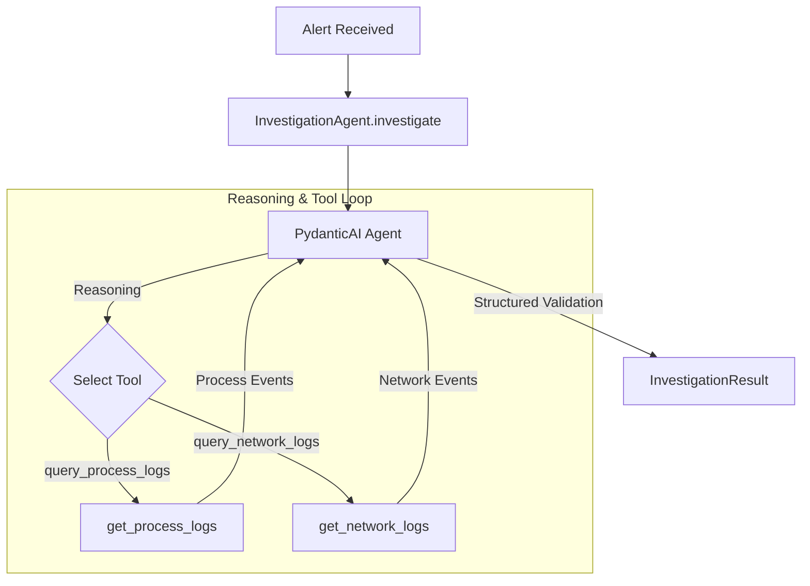

# Investigation Agent Specification

**Status**: Implemented  
**Verification**: Pending  
**Component**: [`app/agents/investigator.py`](file:///home/astute/Projects/AgenticSOC/app/agents/investigator.py)  
**Framework**: PydanticAI (Model-Agnostic)

---

## 1. Purpose

The Investigation Agent is responsible for answering the core operational question:

> **"What actually happened on the host surrounding this security alert?"**

It uses a model-agnostic LLM reasoning loop (via **PydanticAI**) to autonomously inspect incoming alerts, query read-only telemetry tools, pivot across multi-source events (processes and network connections), and synthesize a validated `InvestigationResult`.

---

## 2. Responsibilities

- Receive a structured `Alert` schema.
- Formulate targeted telemetry queries based on alert context.
- Autonomously invoke registered read-only tools:
  - `query_process_logs`: Fetches process creation, command line arguments, user contexts, and parent/child trees.
  - `query_network_logs`: Fetches socket connections, remote IPs, ports, and domains (filterable by PID).
- Perform cross-telemetry correlation: pivot from suspicious process IDs to network socket logs.
- Detect indicators of compromise (e.g., encoded PowerShell invocations, anomalous child reconnaissance binaries, outbound C2 traffic).
- Structure discrete findings into `Evidence` objects with confidence scores.
- Formulate an overall investigation verdict (`suspicious`, `benign`, or `inconclusive`).

---

## 3. Explicit Non-Responsibilities

- **The Investigation Agent does NOT execute direct database or raw log queries**: All access is mediated by read-only tools.
- **The Investigation Agent does NOT take containment or response actions**: It produces analysis only; remediation is deferred to human-in-the-loop workflows.
- **The Investigation Agent does NOT manage high-level triage routing**: Orchestration across multiple specialized agents is handled by the Orchestrator service.

---

## 4. Architecture & Model Integration

### Supported Model Backends
Driven via `AGENT_MODEL` environment variable or API keys:
- **Google Gemini**: `google-gla:gemini-2.0-flash`
- **OpenAI**: `openai:gpt-4o`
- **Anthropic**: `anthropic:claude-3-5-sonnet`
- **Local / Air-Gapped**: `ollama:llama3` / `ollama:deepseek-r1`
- **Offline / Test**: `TestModel` / `FunctionModel`

---

## 5. Interfaces & Schemas

### Input
- `Alert` ([`app/models/alert.py`](file:///home/astute/Projects/AgenticSOC/app/models/alert.py))

### Tools Available
- `query_process_logs(host, timestamp, window_minutes)` ([`app/tools/process_tools.py`](file:///home/astute/Projects/AgenticSOC/app/tools/process_tools.py))
- `query_network_logs(host, timestamp, window_minutes, process_id)` ([`app/tools/network_tools.py`](file:///home/astute/Projects/AgenticSOC/app/tools/network_tools.py))

### Output
- `InvestigationResult` ([`app/models/investigation.py`](file:///home/astute/Projects/AgenticSOC/app/models/investigation.py)) containing:
  - `alert_id`: ID of the investigated alert.
  - `host`: Hostname where events occurred.
  - `verdict`: `"suspicious" | "benign" | "inconclusive"`.
  - `summary`: Narrative synthesis of findings.
  - `evidence`: List of `Evidence` objects (`artifact_type`, `description`, `data`, `confidence`).
  - `investigated_at`: UTC timestamp of investigation completion.

---

## 6. Failure Modes & Edge Cases

- **No Logs Found**: If telemetry is missing, the agent returns an `inconclusive` verdict safely without crashing.
- **Process Found Without Network Traffic**: The agent correlates available process evidence even if network telemetry yields no matching sockets.
- **Zero-Cost Offline Execution**: Tests use PydanticAI `TestModel`, preventing test flakiness or external API network dependencies in CI.
