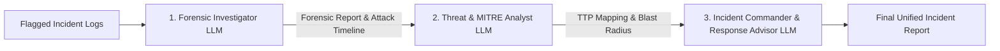

# Multi-Agent Collaborative LLM System Specification

**Status**: Implemented  
**Verification**: Verified  
**Component**: [`app/agents/multi_agent_pipeline.py`](file:///home/astute/Projects/AgenticSOC/app/agents/multi_agent_pipeline.py)  

---

## 1. Overview

The Agentic SOC utilizes a collaborative pipeline of **3 specialized LLM agents** to investigate security incidents with flagged logs:



---

## 2. Specialized Agent Personas

### 🕵️ 1. Forensic Investigator Agent ([`app/agents/forensic_investigator.py`](file:///home/astute/Projects/AgenticSOC/app/agents/forensic_investigator.py))
- **Role**: Lead DFIR Investigator.
- **Responsibilities**:
  - Reconstructs chronological execution trees (parent process -> child process -> command line).
  - Deobfuscates Base64 / encoded payloads.
  - Correlates process creations with network socket openings.
  - Pinpoints initial root causes and identifies compromised hosts and accounts.

### 🎯 2. Threat Intelligence & MITRE Analyst Agent ([`app/agents/threat_analyst.py`](file:///home/astute/Projects/AgenticSOC/app/agents/threat_analyst.py))
- **Role**: Senior CTI & MITRE ATT&CK Specialist.
- **Responsibilities**:
  - Maps attacker behaviors to the MITRE ATT&CK Matrix (Tactics, Techniques, IDs).
  - Assesses adversary sophistication and intent (commodity loader vs. APT).
  - Evaluates blast radius and lateral movement probability.

### 🛡️ 3. Incident Commander & Response Advisor Agent ([`app/agents/response_advisor.py`](file:///home/astute/Projects/AgenticSOC/app/agents/response_advisor.py))
- **Role**: Principal SOC Incident Commander.
- **Responsibilities**:
  - Synthesizes findings into an executive narrative.
  - Determines final verdict (`MALICIOUS`, `SUSPICIOUS`, `BENIGN`, `INCONCLUSIVE`).
  - Produces a prioritized containment, eradication, and recovery action checklist.

---

## 3. CLI Runner

Execute live multi-agent analysis:
```bash
python run_incident_analysis.py --file sample_incident.json
```
