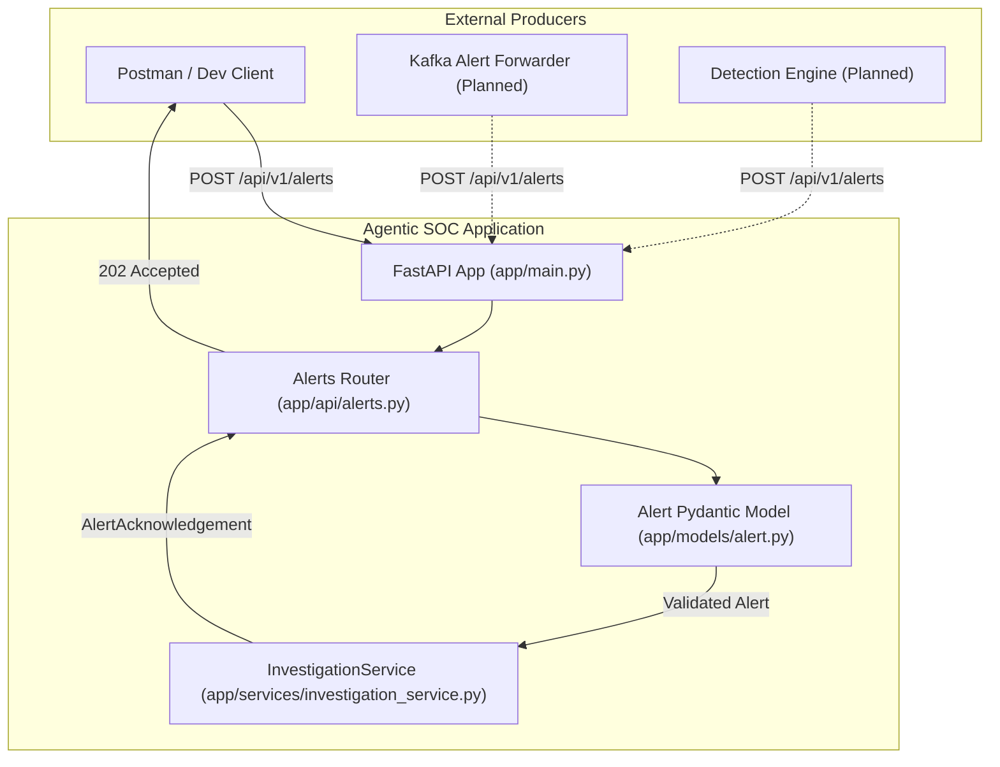

# System Architecture Overview

Status: Implemented (Milestone 1.0 Subsystem Boundary)  
Verification: Verified

## 1. Overall System Architecture

The target architecture for the complete security operations platform consists of two primary domains: the **Detection Pipeline** and the **Agentic SOC**.

```text
[ Endpoint Systems ]
        │
        ▼ (Log Forwarding)
[ Kafka Message Broker ]
        │
        ▼
[ Centralized Log Processing ]
        │
        ▼
[ Hybrid Detection Engine (Rules + ML) ]
        │
        ▼ (Structured Security Alert)
═════════════════════════════════════════════════════════════ Boundary: REST API
        ▼ (HTTP POST /api/v1/alerts)
[ Agentic SOC Ingestion (FastAPI) ]
        │
        ▼
[ Investigation Service ]
        │
        ▼
[ Investigation & Triage Agents ]
        │
        ▼
[ Human-in-the-Loop Analyst Console ]
```

---

## 2. Ingestion Subsystem Boundary (Current State)

As of Milestone 1.0, the system implements the API ingestion boundary separating external producers from internal agent logic:



---

## 3. Subsystem Responsibilities

### Implemented Subsystems
- **API Transport Layer (`app/api/`)**: Manages HTTP request parsing, routing, response code formulation (`202 Accepted`, `422 Unprocessable Content`), and OpenAPI schema generation.
- **Model Validation Layer (`app/models/`)**: Enforces strict schemas and data type coercion for domain entities (`Alert`, `AlertAcknowledgement`).
- **Service Layer (`app/services/`)**: Encapsulates core business processes. `InvestigationService` isolates alert ingestion logic from HTTP transport mechanics.

### Planned Subsystems
- **Orchestration Layer (`app/agents/`)**: Dynamic scheduling and multi-agent coordination.
- **Investigation Agent**: Automated query generation against endpoint/network log tools to determine root causes.
- **Read-Only Tool Interfaces (`app/tools/`)**: Controlled data retrieval tools accessing historical logs and MITRE ATT&CK intelligence.
- **Threat Analysis Agent**: Contextualizes findings and assesses threat impact.
- **Human-in-the-Loop Review**: Analyst approval workflow for suggested response actions.
